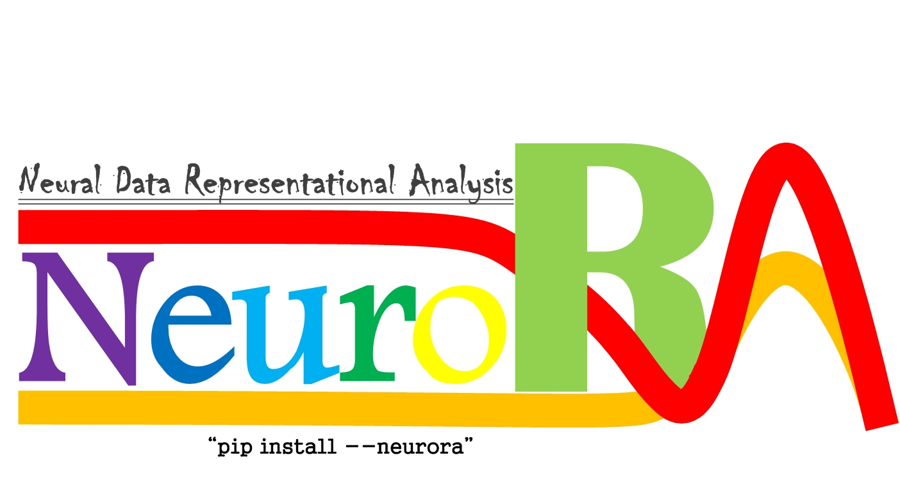
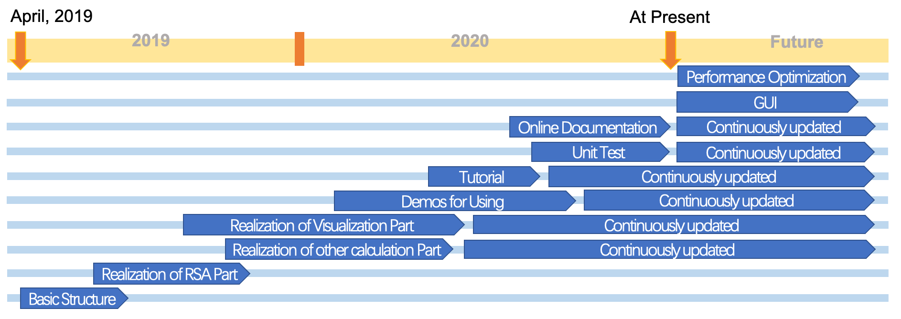

#NeuroRA

**A Python Toolbox of Representational Analysis from Multimode Neural Data**

## Overview
**Representational Similarity Analysis (RSA)** has become a popular and effective method to measure the representation of multivariable neural activity in different modes.

**NeuroRA** is an easy-to-use toolbox based on **Python**, which can do some works about **RSA** among nearly all kinds of neural data, including **behavioral, EEG, MEG, fNIRS, sEEG, ECoG, fMRI and some other neuroelectrophysiological data**.
In addition, users can do **Neural Pattern Similarity (NPS)**, **Spatiotemporal Pattern Similarity (STPS)** & **Inter-Subject Correlation (ISC)** on **NeuroRA**.

## Installation
> pip install neurora

## Paper

Lu, Z., & Ku, Y. NeuroRA: A Python toolbox of representational analysis from multi-modal neural data. (bioRxiv: https://doi.org/10.1101/2020.03.25.008086)

## Website & How to use
See more details at the [NeuroRA website](https://zitonglu1996.github.io/NeuroRA/).

You can read the [Documentation here](https://neurora.github.io/documentation/index.html) or download the [Tutorial here](https://zitonglu1996.github.io/NeuroRA/neurora/Tutorial.pdf) to know how to use NeuroRA.

## Required Dependencies:

- **[Numpy](http://www.numpy.org)**: a fundamental package for scientific computing.
- **[SciPy](https://www.scipy.org/scipylib/index.html)**: a package that provides many user-friendly and efficient numerical routines.
- **[Matplotlib](https://matplotlib.org)**: a Python 2D plotting library.
- **[NiBabel](https://nipy.org/nibabel/)**: a package prividing read +/- write access to some common medical and neuroimaging file formats.
- **[Nilearn](https://nilearn.github.io/)**: a Python module for fast and easy statistical learning on NeuroImaging data.
- **[MNE-Python](https://mne.tools/)**: a Python software for exploring, visualizing, and analyzing human neurophysiological data.

## Features

- Calculate the Neural Pattern Similarity (NPS)

- Calculate the Spatiotemporal Neural Pattern Similarity (STPS)

- Calculate the Inter-Subject Correlation (ISC)

- Calculate the Representational Dissimilarity Matrix (RDM)

- Calculate the Representational Similarity based on RDMs

- One-Step Realize Representational Similarity Analysis (RSA)

- Statistical Analysis

- Save the RSA result as a NIfTI file for fMRI

- Visualization for RSA results

## Demos
There are several demos for NeuroRA, and you can see them in /demos/.. path (both .py files and .ipynb files are provided).

|   | Run the Demo | View the Demo |
| - | --- | ---- |
| Demo 1 |  |  |
| Demo 2 |  |  |
| Demo 3 |  |  |

## Road-Map of NeuroRA

## About NeuroRA
**Noteworthily**, this toolbox is currently only a **test version**. 
If you have any question, find some bugs or have some useful suggestions while using, you can email me and I will be happy and thankful to know.
>My email address: 
>zitonglu1996@gmail.com / zitonglu@outlook.com

>My personal homepage:
>https://zitonglu1996.github.io
