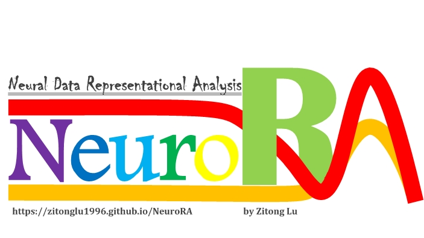

**A Python Toolbox for Multimode Neural Data Representational Analysis**

## Overview
**Representational Similarity Analysis (RSA)** has become a popular and effective method to measure the representation of multivariable neural activity in different modes.

**NeuroRA** is an easy-to-use toolbox based on **Python**, which can do some works about RSA among nearly all kinds of neural data, including **behavioral, EEG, MEG, fNIRS, ECoG, electrophysiological and fMRI data**.

## Installation
> pip install neurora

## Website
See more details at the [NeuroRA website](https://zitonglu1996.github.io/NeuroRA/).

## Features
You can not only calculate the representational dissimilarity matrix (RDM) but also calculate the correlation coefficient (or similarity) between different RDMs. In addition, you can plot the timing curve (for EEG, MEG, etc) and obtain a  NIFTI file (for fMRI).

## Required Dependencies:
- **[Numpy](http://www.numpy.org)**: a fundamental package for scientific computing
- **[Matplotlib](https://matplotlib.org)**: a Python 2D plotting library
- **[NiBabel](https://nipy.org/nibabel/)**: a package prividing read +/- write access to some common medical and neuroimaging file formats

## About NeuroRA
**Noteworthily**, this toolbox is currently only a **test version**. 
If you have any question, find some bugs or have some useful suggestions while using, you can email me and I will be happy and thankful to know.
>My email address: 
>zitonglu1996@gmail.com / zitonglu@outlook.com

>My personal homepage:
>https://zitonglu1996.github.io
