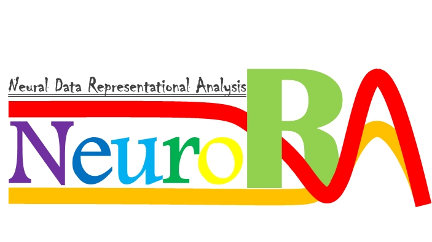

# NeuroRA

**A Python Toolbox for Multimode Neural Data Representational Analysis**

## Overview
**Representational Similarity Analysis (RSA)** has become a popular and effective method to measure the representation of multivariable neural activity in different modes.

**NeuroRA** is an easy-to-use toolbox based on **Python**, which can do some works about RSA among nearly all kinds of neural data, including **behavioral, EEG, MEG, fNIRS, ECoG, electrophysiological and fMRI data**.

## Features
You can not only calculate the representational dissimilarity matrix (RDM) but also calculate the correlation coefficient (or similarity) between different RDMs. In addition, you can plot the timing curve (for EEG, MEG, etc) and obtain a  NIFTI file (for fMRI).

### rdm_cal.py (calculate the RDM)

- bhvRDM(bhv_data, sub_opt=0, data_opt=1)
> - a function for calculating the RDM based on behavioral data
> - return a RDM/RDMs

- eegRDM(EEG_data, sub_opt=0, chl_opt=0, time_opt=0)
> - a fucntion for calculating the RDM based on EEG/MEG/fNIRS data
> - return a RDM/RDMs

- ecogRDM(ele_data, chls_num, opt="all")
> - a function for calculating the RDM based on ECoG/electrophysiological data
> - return a RDM/RDMs

- fmriRDM(fmri_data, ksize=[3, 3, 3], strides=[1, 1, 1])
> - a function for calculating the RDM based on fMRI dat
> - return RDMs

### rdm_plot.py (plot the RDM)
- plot_rdm_1(rdm)
- plot_rdm_2(rdm)
> - two forms of presentation of the RDM

### rsa_corr.py (calculate the correlation coefficient between two RDMs)
- rsa_correlation_spearman(RDM1, RDM2)
- rsa_correlation_pearson(RDM1, RDM2)
- rsa_similarity(RDM1, RDM2)
- rsa_distance(RDM1, RDM2)
> - four functions (Spearman Correlation, Pearson Correlation, Cosine Similarity & Euclidean Distance) you can select to measure the similarity of different RDMs
> - here we calculate by the off-diagonal method

### corr_cal.py (calculate the correlation coefficient between two different modes data)
- bhvANDeeg_corr(bhv_data, EEG_data, sub_opt=0, bhv_data_opt=1, chl_opt=0, time_opt=0, method="spearman")
> - for behavioral data and EEG/MEG/fNIRS data

- bhvANDecog_corr(bhv_data, ele_data, chls_num, ecog_opt="allin", method="spearman")
> - for behavioral data and ECoG/electrophysiological data

- bhvANDfmri_corr(bhv_data, fmri_data, bhv_data_opt=1, ksize=[3, 3, 3], strides=[1, 1, 1], method="spearman")
> - for behavioral data and fMRI data

- eegANDfmri_corr(eeg_data, fmri_data, chl_opt=0, ksize=[3, 3, 3], strides[1, 1, 1], method="spearman")
> - for EEG/MEG/fNIRS data and fMRI data

### corr_plot_time.py (plot the correlation coefficients by time sequence)
- plot_corrs_bytime(corrs, time_unit=[0, 1])

### corr_to_nii.py (save the correlation coefficients in a *.nii* file)
- corr_save_nii(corrs, filename, affine, size=[60, 60, 60], ksize=[3, 3, 3], strides=[1, 1, 1], p=1, r=0, similarity=0, distance=0)

### stuff.py (some simple but important processes)
- limtozero(x)
- get_affine(file_name)

## Required Dependencies:
- **[Numpy](http://www.numpy.org)**: a fundamental package for scientific computing
- **[Matplotlib](https://matplotlib.org)**: a Python 2D plotting library
- **[NiBabel](https://nipy.org/nibabel/)**: a package prividing read +/- write access to some common medical and neuroimaging file formats

## About NeuroRA
**Noteworthily**, this toolbox is currently only a **test version**. 
If you have any question, find some bugs or have some useful suggestions while using, you can email me and I will be happy and thankful to know.
>My email address: 
>zitonglu1996@gmail.com

>My personal homepage:
>https://zitonglu1996.github.io

